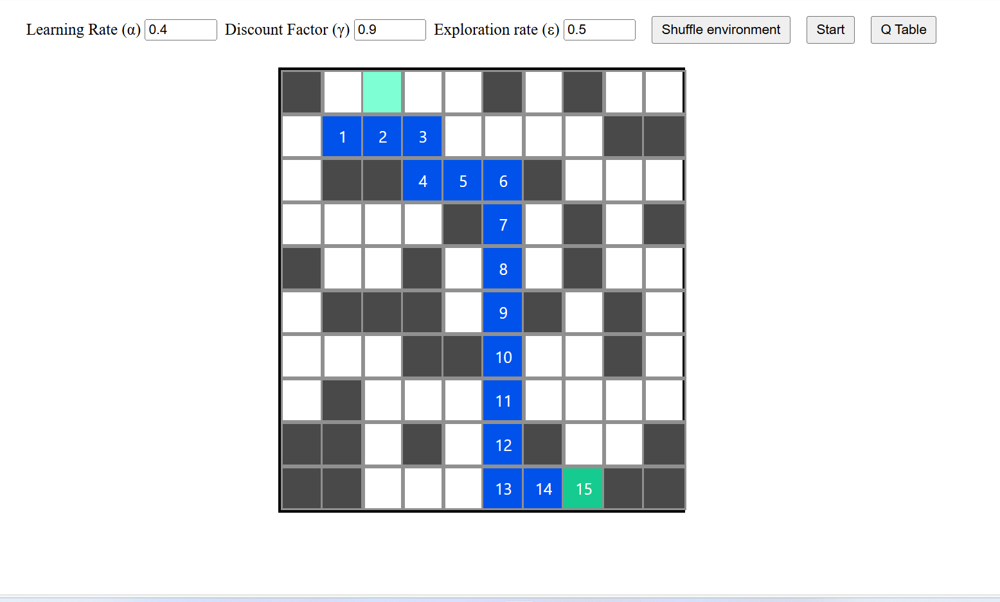
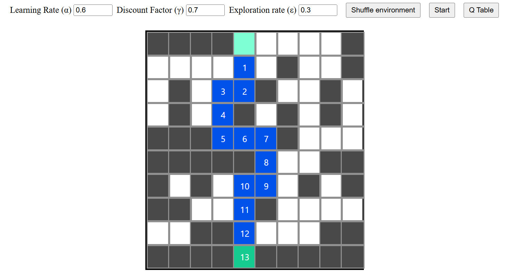

# Reinforcement Learning

## Using Q Learning to find the shortest path

A reinforcement learning implementation that uses Q Learning to discover the shortest path from an initial state to a goal state.

Implemented in Javascript

𝑄(𝑠,𝑎)←𝑄(𝑠,𝑎)+𝛼[𝑟 + 𝛾max𝑎′𝑄(𝑠′,𝑎′) − 𝑄(𝑠,𝑎)]

